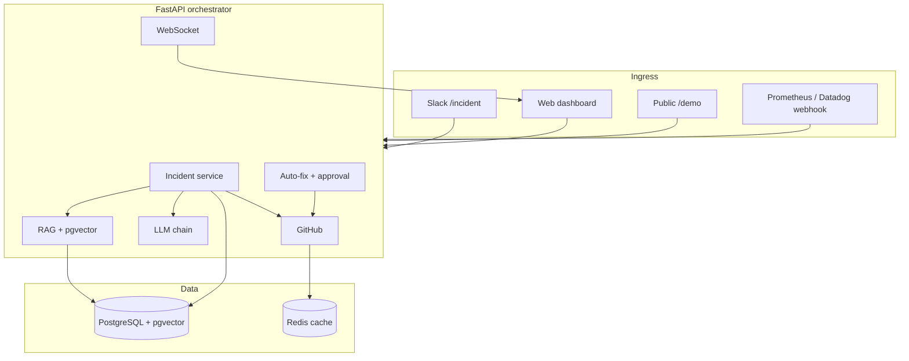

# AEGIS PRO

**Open-source AI incident commander that turns an alert into a reviewed fix PR.**

Paste a public GitHub repo. AEGIS PRO finds a real production risk in a real file and returns a full incident: the failing line, the code around it, the blame, related changes, and a suggested fix. Every link on the incident page points at something you can verify on GitHub.

[Live demo](https://aegis-pro-six.vercel.app/demo) · [Architecture](docs/ARCHITECTURE.md) · [Contributing](CONTRIBUTING.md) · [API docs](http://localhost:8000/docs)

---

## What it does

```
Alert or repo URL
        │
        ▼
  Locate the failing surface   →  real file, real line
  Blame + related changes      →  commit, author, PRs (LLM-scored)
  Diagnose                     →  root cause, severity, blast radius
  Propose a fix                →  diff staged for human approval
  Open a reviewed PR           →  when AUTO_FIX_MODE allows writes
```

PagerDuty and Datadog tell you *that* something broke. AEGIS PRO tells you *why*, *who changed it*, and *what to merge* — from your own codebase and incident history.

The public `/demo` route is the front door: no Slack workspace, no GitHub token, no war room.

---

## Demo in 60 seconds

1. Open [https://aegis-pro-six.vercel.app/demo](https://aegis-pro-six.vercel.app/demo) (or `/demo` on a local stack).
2. Paste any public GitHub URL — HTTPS, SSH, or `owner/repo`.
3. Watch the pipeline: parse → tree → file select → LLM risk → related changes → incident.

What you get back is bound to GitHub:

| Incident field | Source |
|---|---|
| File + line | Selected blob + LLM finding |
| Code context | Real file content around that line |
| Blame | `fetch_file_commits` + contributors |
| Related changes | Commits/PRs that touched the file, LLM-scored |
| Suggested fix | LLM, shown for approval — never auto-merged |

Three successful analyses per session, then signup. GitHub's unauthenticated API is cached in Redis (repo/tree 1h, files 30m, PRs 15m).

---

## Architecture



Full diagrams, the `/demo` pipeline, and safety modes: [docs/ARCHITECTURE.md](docs/ARCHITECTURE.md).

**Stack:** FastAPI · PostgreSQL + pgvector · Redis · React + TypeScript · Tailwind · D3.js · Groq / Gemini / Azure / Ollama / OpenRouter · Slack Bolt · Docker

---

## Features

| Feature | Status |
|---|---|
| Public `/demo` — paste a repo, get a verifiable incident | ✅ |
| Slack `/incident` with Block Kit | ✅ |
| Prometheus / Datadog webhooks | ✅ |
| Stack-trace parsing (Java, Python, Go) | ✅ |
| Blast radius across the service graph | ✅ |
| RAG over historical incidents (`all-MiniLM-L6-v2` + pgvector) | ✅ |
| Provider-agnostic LLM chain with fallbacks | ✅ |
| GitHub file fetch, blame, related PRs | ✅ |
| Auto-fix diff + human approval dashboard | ✅ |
| Real GitHub PR creation | 🚧 [#30](https://github.com/MakerYuichi/Aegis-pro/issues/30) |
| Real-time WebSocket dashboard | ✅ |
| On-call rotation | ✅ |
| `AUTO_FIX_MODE=read_only` by default | ✅ |
| Docker Compose one-command stack | ✅ |

---

## Getting started

### Prerequisites

- Docker and Docker Compose
- Node.js 18+ (for the dashboard)
- Optional for production mode: Slack app, GitHub token, Auth0, LLM API key

### Local stack (demo mode)

See AEGIS PRO against a seeded company — 8 services, 11 incidents, 27 on-call engineers — and hit `/demo` with a real public repo. Demo mode still needs a real LLM key for repo analysis (`LLM_PROVIDER=groq` in `demo.env`); GitHub and Slack stay mocked inside the authenticated dashboard.

```bash
git clone https://github.com/MakerYuichi/Aegis-pro.git
cd Aegis-pro

cp backend/orchestrator/.env.example backend/orchestrator/.env
# Set GROQ_API_KEY (or another provider) in that file.

docker-compose --env-file demo.env down -v
docker-compose --env-file demo.env up -d

cd frontend && cp .env.example .env && npm install && npm run dev
```

- Dashboard: http://localhost:5173
- Public demo: http://localhost:5173/demo
- API: http://localhost:8000
- OpenAPI: http://localhost:8000/docs

`docker-compose --env-file demo.env down -v` is required on first run so Postgres loads `database/migrations`. Without `-v`, an old volume keeps stale data.

### Production-shaped stack

```bash
cp backend/orchestrator/.env.example backend/orchestrator/.env
# Fill Auth0, GitHub, Slack, and LLM keys.

docker-compose up -d
sleep 10
curl -X POST http://localhost:8000/api/v1/services/seed
```

Defaults without `demo.env`: `DEMO_MODE=false`, `LLM_PROVIDER=groq`, `AUTO_FIX_MODE=read_only`. A fresh install does not write to GitHub.

### Verify demo seed

```bash
docker-compose exec postgres psql -U postgres -d aegis \
  -c "SELECT COUNT(*) FROM incidents WHERE extra_metadata->>'demo_seed' = 'true';"

docker-compose logs orchestrator | grep backfill
curl http://localhost:8000/health
```

Expect 11 seeded incidents, a backfill log line, and `"demo_mode": true` on `/health`.

---

## How the AI works

1. **File selection (demo)** — a pure scorer picks the blob most likely to be a production failure surface (`src/`, handlers, auth/payment), and rejects docs/tutorials instead of fabricating an incident.
2. **Risk analysis** — the file is numbered and sent to `LLMService.complete_raw(response_format="json_object")`. Malformed JSON returns `None`; the API never invents a finding.
3. **RAG (authenticated incidents)** — each incident is a 384-d vector. New alerts retrieve the top 3 similar incidents as LLM context.
4. **Related changes** — commits that touched the file are merged with the PRs that landed them. The LLM scores each entry against the failing line using the real commit message.
5. **Auto-fix** — a diff is staged. Humans approve in the dashboard. GitHub writes happen only when `AUTO_FIX_MODE` is `pr_draft` or `auto_pr`.

---

## Safety

| Control | Default | Effect |
|---|---|---|
| `AUTO_FIX_MODE` | `read_only` | Diffs only; no GitHub writes |
| `AUTO_FIX_MODE=pr_draft` | opt-in | Stage a PR payload; dashboard approval required |
| `AUTO_FIX_MODE=auto_pr` | opt-in | Create the PR (see [#30](https://github.com/MakerYuichi/Aegis-pro/issues/30)) |
| `LLM_PROVIDER` | `groq` / `mock` / `ollama` / `azure` / `gemini` / `openrouter` | Keep analysis on Groq, Azure, or fully local Ollama |
| Mutating HTTP APIs | Auth0 JWT | `/rollback`, `/declare`, `/approve`, `/seed` |

Verified by [`tests/test_autofix_modes.py`](backend/orchestrator/tests/test_autofix_modes.py).

---

## API

| Endpoint | Method | Description |
|---|---|---|
| `/health` | GET | Health, `demo_mode`, `auto_fix_mode` |
| `/api/v1/demo/generate` | POST | Public pipeline (`DEMO_MODE=true`) |
| `/api/v1/demo/default` | GET | Sample Aegis-pro incident |
| `/api/v1/demo/reset` | POST | Clear demo session cookie |
| `/api/v1/services` | GET | Service catalog |
| `/api/v1/incident/declare` | POST | Declare an incident |
| `/api/v1/incident/{id}` | GET | Incident detail |
| `/api/v1/incidents` | GET | List incidents |
| `/api/v1/incident/{id}/approve` | POST | Approve auto-fix |
| `/webhook/alert` | POST | Monitoring alerts |
| `/slack/events` | POST | Slack events |
| `/ws/incidents` | WebSocket | Live incident stream |

---

## Tests

```bash
cd backend/orchestrator
LLM_PROVIDER=mock LLM_FALLBACKS= pytest tests/ -v
```

Backend tests are mocked. The suite does not call GitHub or an LLM provider. Frontend: `cd frontend && npm run lint && npm run build`.

---

## License

AEGIS PRO is **source-available** under the [Business Source License 1.1](LICENSE.md).

- Free for internal use, evaluation, research, and personal projects
- Commercial license required for competing products or hosted resale
- Converts to Apache 2.0 four years after each release

Commercial licensing: makeryuichii@gmail.com

---

Built by [MakerYuichi](https://github.com/MakerYuichi)
