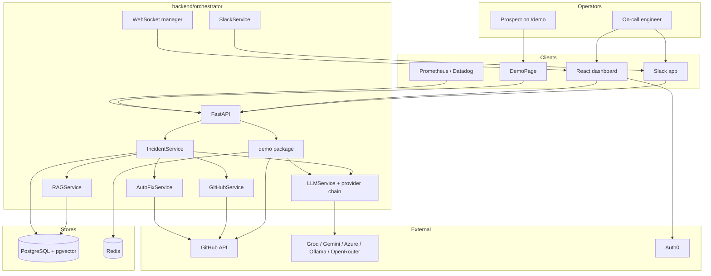
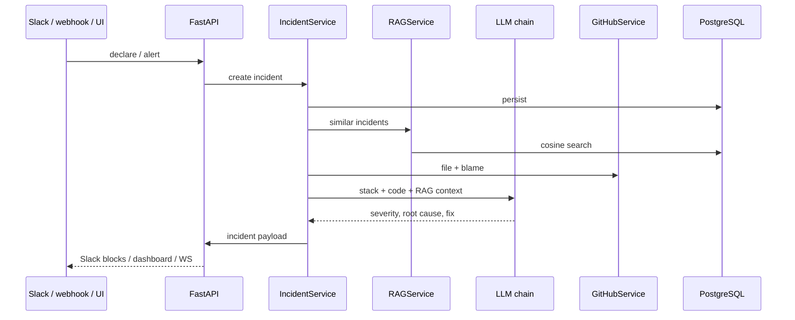
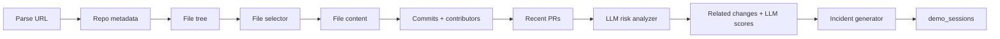

# Architecture

AEGIS PRO is an AI incident commander: it turns an alert (or a public repo URL) into a reviewed fix, bound to real files, commits, and people on GitHub.

## System context

## Runtime layout

| Process | Role |
|---|---|
| `frontend` (Vite, port 5173) | Dashboard + `/demo`. `IncidentView` is shared by both. |
| `orchestrator` (Uvicorn, port 8000) | FastAPI: incidents, Slack, webhooks, demo pipeline, WebSocket. |
| `postgres` (`pgvector/pgvector:pg15`) | Incidents, services, on-call, embeddings, `demo_sessions`. |
| `redis` | Rate limits, GitHub demo cache. Fails open if down. |

Compose file: [`docker-compose.yml`](../docker-compose.yml). Demo flags: [`demo.env`](../demo.env).

When `DEMO_MODE=true`, service factories return mock GitHub and Slack for the **authenticated** product paths. The public demo fetcher talks to GitHub's unauthenticated API directly and does not need a token.

## Authenticated incident path

Slack must ack within 3 seconds. LLM work runs in a background task; the message is updated via `response_url`.

## Public `/demo` pipeline

Entry: `POST /api/v1/demo/generate` in [`backend/orchestrator/src/demo/endpoints.py`](../backend/orchestrator/src/demo/endpoints.py).

| Stage | Module | Notes |
|---|---|---|
| Cap + rate limit | `endpoints.py` | 3 successful tries / session; Redis 20/hour, 1 per 3s, fail-open |
| Parse | `repo_parser.py` | 7 URL shapes, 5 error reasons, no silent fallbacks |
| GitHub read | `github_fetcher.py` | Unauthenticated public API; Redis TTLs in `cache.py` |
| Pick file | `file_selector.py` | Pure function. `docs_src/tutorial*.py` loses to real library code |
| Risk | `risk_analyzer.py` + `_llm.py` | JSON object; any malformed field → `None` |
| Related changes | `incident_generator.py` | Commits ∪ PRs, scored against `(path, line)` |
| Assemble | `incident_generator.py` | Matches frontend `Incident`. `None` if no file/risk/content |

Typical wall clock is dominated by two LLM calls (risk ~6s, related-change scoring ~5s). GitHub reads are usually sub-second when cached.

### File selector confidence

- **high** — score ≥ 4.0 and a code extension → bind the incident to that file
- **low** — code extension, weaker score → still bind, lower confidence
- **fallback** — no code extension → return `not_code` instead of inventing a finding

### Related changes

Up to 10 commits that touched the file. Each commit is joined to the PR that merged it when one exists. The LLM scores every row; scores are model output (e.g. `0.80`, `0.20`), not placeholders.

## LLM providers

[`src/llm/`](../backend/orchestrator/src/llm/) is a chain: primary `LLM_PROVIDER` then `LLM_FALLBACKS`. Demo analysis uses `complete_raw(response_format="json_object")` so Groq, Gemini, Azure, Ollama, and OpenRouter share one contract.

`LLM_PROVIDER=mock` is for CI and dashboard seed mode. Repo-on-`/demo` analysis needs a real model; `demo.env` sets `LLM_PROVIDER=groq`.

## Auto-fix safety

| `AUTO_FIX_MODE` | Behavior |
|---|---|
| `read_only` | Generate a diff. No GitHub write APIs. Default. |
| `pr_draft` | Stage a PR payload. Dashboard approve/reject. |
| `auto_pr` | Create the PR immediately (tracked in issue #30). |

## Frontend surfaces

| Route | Who | What |
|---|---|---|
| `/` (signed out) and `/demo` | Prospect / operator preview | `DemoPage`: landing → analyzing → result |
| `/`, `/incidents`, `/services`, `/oncall`, `/approvals`, `/settings` | Signed-in operator | Catalog, live feed, graph, on-call, fix approval |
| `IncidentView` | Both | Code context, blame, related changes, blast radius, timeline |

## Trust boundary

- Public demo: read-only GitHub + LLM. Session cookie. No JWT required. `DEMO_MODE=false` 404s the demo routes.
- Authenticated API: Auth0 JWT on mutating routes.
- Secrets live in `backend/orchestrator/.env` (gitignored). `demo.env` has flags only.
